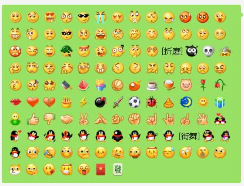

# wechatemoj
微信emoj表情对应的汉字表示代码

微信聊天界面能够支持的汉字代码方式输入的图标一共有这些, 其他的通过文字写入的不太支持, 有需要的小伙伴们, 可以参考参考:

[微笑][撇嘴][色][发呆][得意][流泪][害羞][闭嘴][睡][大哭][尴尬][发怒][调皮][呲牙][惊讶][难过][酷][囧][抓狂][吐][偷笑][愉快][白眼][傲慢][饥饿][困][惊恐][流汗][憨笑][悠闲][奋斗][咒骂][疑问][嘘][晕][折磨][衰][骷髅][敲打][再见][擦汗][抠鼻][鼓掌][糗大了][坏笑][左哼哼][右哼哼][哈欠][鄙视][委屈][快哭了][阴险][亲亲][吓][可怜][菜刀][西瓜][啤酒][篮球][乒乓][咖啡][饭][猪头][玫瑰][凋谢][嘴唇][爱心][心碎][蛋糕][闪电][炸弹][刀][足球][瓢虫][便便][月亮][太阳][礼物][拥抱][强][弱][握手][胜利][抱拳][勾引][拳头][差劲][爱你][NO][OK][爱情][飞吻][跳跳][发抖][怄火][转圈][磕头][回头][跳绳][右太极][激动][街舞][献吻][左太极][投降][嘿哈][捂脸][奸笑][机智][皱眉][耶][吃瓜][加油][汗][天啊][Emm][社会社会][旺柴][好的][打脸][加油加油][哇][红包][發]
